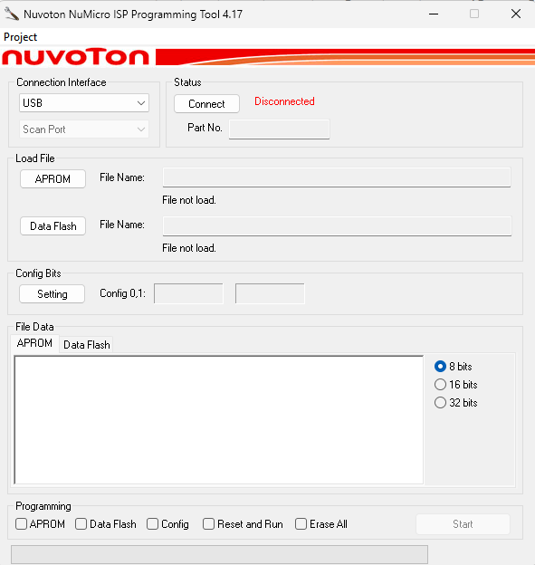
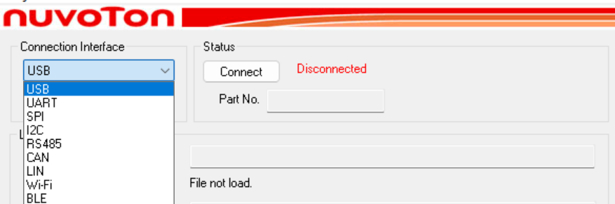
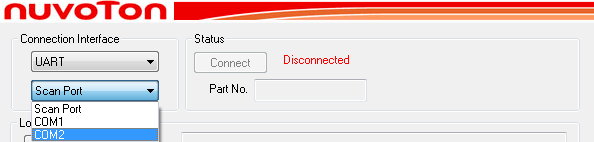
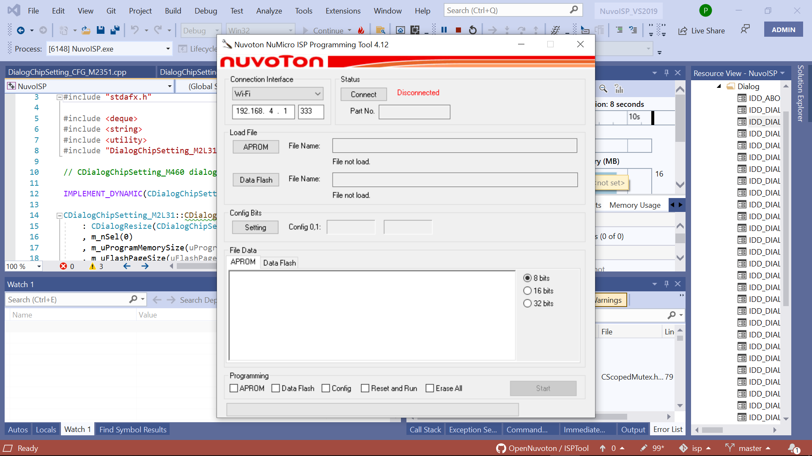
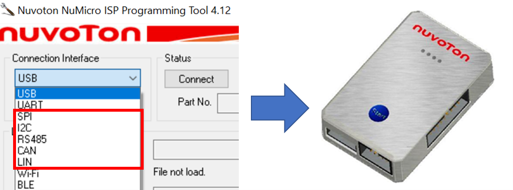
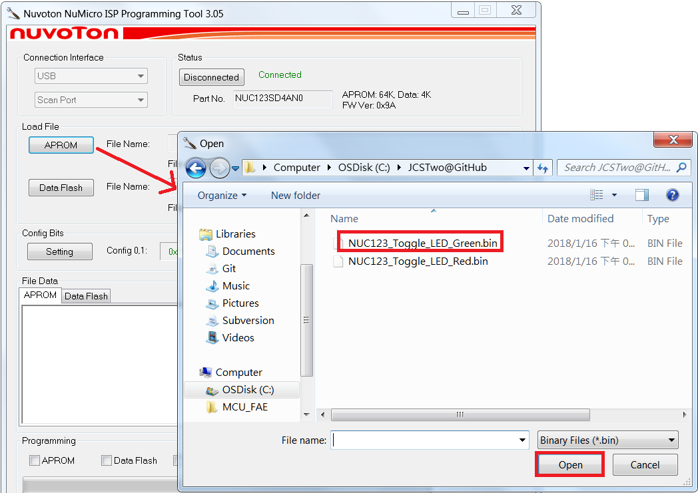
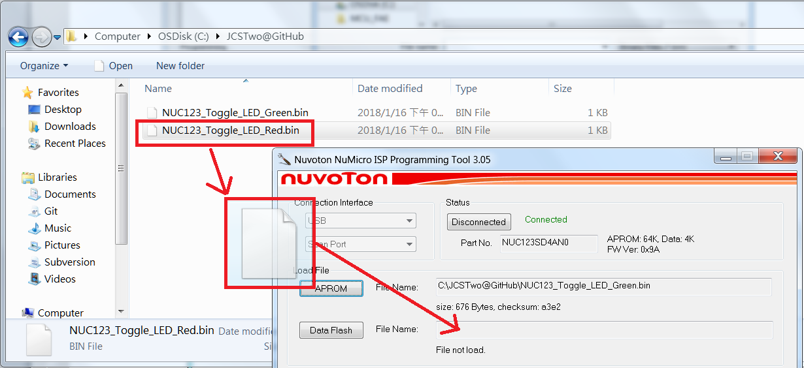
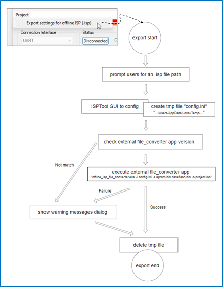
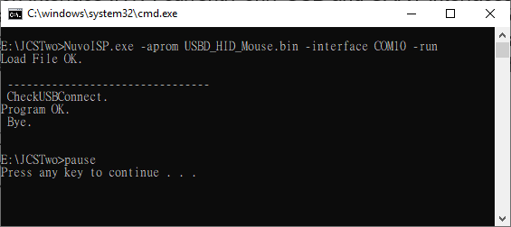
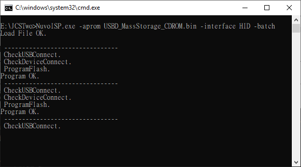

# Getting Started

## System Requirements

- **OS:** Windows (7 or later)
- **Hardware:** One of the following connection setups:
  - USB cable — for direct USB HID connection to target
  - Serial cable — for UART connection
  - Nu-Link2-Pro Adaptor — required for SPI, I²C, RS485, CAN, and LIN interfaces (set to ISP-Bridge mode)
  - Wi-Fi or BLE — for wireless connection

The target chip must have an ISP bootloader programmed into LDROM. The chip must be configured to boot from LDROM.

ISP sample code is available in each chip's Board Support Package (BSP). For example, the M480BSP includes ISP_CAN, ISP_HID, ISP_HID_20, ISP_I2C, ISP_RS485, ISP_SPI, and ISP_UART samples:

[https://github.com/OpenNuvoton/M480BSP/tree/master/SampleCode/ISP](https://github.com/OpenNuvoton/M480BSP/tree/master/SampleCode/ISP)

The ISPTool repository is available on GitHub — check for the latest updates:

[https://github.com/OpenNuvoton/ISPTool](https://github.com/OpenNuvoton/ISPTool)

## Launching the Application

Run **NuvoISP.exe**.

- **With no command-line arguments:** The GUI window opens.
- **With command-line arguments:** The tool runs in headless CLI mode (see [Section 9](#9-command-line-mode)).

---

# Main Window Overview

The main window is divided into the following areas:

| Area | Description |
|------|-------------|
| **Connection** | Interface selector, port settings, Connect button, connection status |
| **Chip Information** | Part number, memory sizes, firmware version, CONFIG register values |
| **File Loading** | Browse buttons and file paths for APROM, Data Flash, and SPI Flash binaries |
| **Hex Data Viewer** | Tabbed view of loaded binary data in 8-bit, 16-bit, or 32-bit hex format |
| **Programming Options** | Checkboxes to select what to program (APROM, Data Flash, CONFIG, SPI Flash, Erase) |
| **Progress & Status** | Progress bar and status text showing current operation |

The **menu bar** contains:
- **Project** — Export settings for offline ISP (.isp), enabled only when connected.



*Figure 2‑1 Main Dialog*

---

## Connecting to a Target Device

### Selecting the Communication Interface

Use the **Interface** dropdown at the top of the window. The available options are:

| Interface | Connection Method |
|-----------|------------------|
| **USB** | Direct USB HID connection to the target chip |
| **UART** | Serial COM port connection |
| **SPI** | Via Nu-Link2-Pro or Nu-Link3-Pro ISP-Bridge |
| **I2C** | Via Nu-Link2-Pro or Nu-Link3-Pro ISP-Bridge |
| **RS485** | Via Nu-Link2-Pro or Nu-Link3-Pro ISP-Bridge |
| **CAN** | Via Nu-Link2-Pro or Nu-Link3-Pro ISP-Bridge |
| **LIN** | Via Nu-Link2-Pro or Nu-Link3-Pro ISP-Bridge |
| **Wi-Fi** | TCP/IP connection via IP address and port |
| **BLE** | Bluetooth Low Energy connection |

**Interface-specific requirements:**

| Interface | Requirement |
|-----------|-------------|
| **USB** | An entry pin must be tied to GND to activate ISP mode. |
| **UART** | Specify the Virtual COM port number. |
| **CAN** | A CAN transceiver is required on the target board. |
| **Wi-Fi** | Specify the IP address and port. Ensure Wi-Fi access is enabled on the PC. Requires a wireless module connected to the target chip via UART, functioning as an Access Point with "Wi-Fi UART pass-through" capability. |
| **BLE** | Ensure BLE access is enabled on the PC. Uses the same wireless module as Wi-Fi, operating as a BLE server with "BLE UART pass-through" functionality. |



*Figure 3‑1 Connection via USB Interface*



*Figure 3‑2 Connection via UART Interface using specific COM port*



*Figure 3‑3 Connection via Wi-Fi Interface*

### Configuring Interface Options

Depending on the selected interface, additional controls appear:

- **UART:** A COM port dropdown appears. It is auto-populated from available serial ports on the system.
- **Wi-Fi:** An IP address field (default `192.168.4.1`) and port number field (default `333`) appear.
- **BLE:** A device name field appears showing the connected BLE device.
- **All others:** No additional configuration is needed.

Since version 3.00, SPI, I²C, RS485, CAN, and LIN interfaces are supported via a Nu-Link2-Pro adapter in ISP-Bridge mode. For interface connection details, refer to Chapter 3 of the [Nu-Link2-Pro Debugger and Programmer User Manual](https://www.nuvoton.com/resource-download.jsp?tp_GUID=UG1320200319174043).



*Figure 3‑4 Connection Interface via Nu-Link2-Pro ISP-Bridge functionality*

### Establishing a Connection

1. Select the desired interface and configure any options.
2. Prepare the target device:
   - **USB:** Ensure the detect pin is held LOW.
   - **UART / SPI / I²C / RS485 / CAN / LIN:** Ensure the target is booted into LDROM.
   - **SPI / I²C / RS485 / CAN / LIN:** Ensure Nu-Link2-Pro is connected and in ISP-Bridge mode.
3. Click **Connect**.

The tool polls the target board every 40 ms (200 ms for LIN, Wi-Fi, and BLE) until a connection is established or the **Stop** button is clicked. If there is no response, reset the MCU to execute the ISP code.

The button text changes to **"Stop check"** while scanning for a device. The status area shows **"Waiting for device connection"**.

On success, the status changes to **"Connected"** (green) and chip information is populated automatically. The button text changes to **"Disconnected"** (acting as a disconnect button).

To disconnect, click the button again.

### Viewing Chip Information

Once connected, the following information is displayed:

- **Part Number** — Detected chip (e.g., M480, M2351, NUC131)
- **Memory Sizes** — APROM and Data Flash sizes (e.g., "APROM: 128K, Data: 16K")
- **Firmware Version** — ISP bootloader version (e.g., "FW Ver: 0x30")
- **CONFIG Values** — Current CONFIG register values read from the chip. Values are color-coded:
  - **Green** — matches your local settings
  - **Red** — differs from your local settings

---

## Loading Firmware Files

### Loading an APROM File

1. Click the **APROM** button (labeled "Code" for some chip types).
2. Browse and select a binary file (`.bin`).
3. The file path, size, and 16-bit checksum are displayed below the button.



*Figure 4‑1 Click Button to Load Image file*

### Loading a Data Flash File

1. Click the **Data Flash** button (labeled "APROM_NS" on secure chips like M2351, or "Data" on some series).
2. Browse and select a binary file.
3. The file path, size, and checksum are displayed.

> **Note:** This button is hidden for chips that do not have a separate Data Flash region.

### Loading a SPI Flash File

1. Click the **SPI Flash** button.
2. Browse and select a binary file (max 2 MB).

> **Note:** This button is only visible for chips with external SPI Flash support (e.g., M487KMCAN).

### Drag-and-Drop Support

You can also drag and drop a binary file from Windows Explorer onto the APROM or Data Flash button area to load it.



*Figure 4‑2 Drag image file from explorer window*

---

## Viewing Hex Data

The **Hex Data Viewer** section displays loaded binary data in a tabbed view. Tabs are shown for each loaded region (APROM, Data Flash, SPI Flash).

Switch display format with the radio buttons:

| Mode | Format | Example |
|------|--------|---------|
| **8-bit** | Individual bytes | `00000000: 12 34 56 78 9A BC DE F0 ...` |
| **16-bit** | 16-bit words | `00000000: 1234 5678 9ABC DEF0 ...` |
| **32-bit** | 32-bit dwords | `00000000: 12345678 9ABCDEF0 ...` |

Click **Save As** to export the currently viewed data to a `.bin` file.

---

## Configuring Chip Settings

Click the **CONFIG** button to open the chip-specific settings dialog. The dialog layout depends on the connected chip series and provides graphical controls for:

- Clock source configuration
- Brown-out detection level
- GPIO pin settings
- Flash protection (APROM/LDROM write protect)
- Security lock options
- ISP interface enable/disable

> **Note:** The CONFIG button is disabled when no device is connected, or for chips that do not support user-configurable CONFIG registers (e.g., NUC505). It is also disabled for the CAN interface on certain chips.

> **Note:** The ISP tool does not allow modifying the Boot Select setting. To change it, use the Nuvoton NuMicro® ICP Programming Tool.

After modifying settings, close the dialog. The updated CONFIG values appear in the main window, color-coded red if they differ from the values currently on the chip.

---

## Programming the Device

### Setting Programming Options

Before starting, select the desired operations using the checkboxes:

| Checkbox | Description |
|----------|-------------|
| **APROM** | Program the loaded APROM binary to flash. Requires a file to be loaded. |
| **Data Flash** | Program the loaded Data Flash binary. Requires a file to be loaded. |
| **CONFIG** | Write the CONFIG register values set in the CONFIG dialog. Security lock enables write protection; programming APROM or using Erase All removes it. Changes take effect after system reboot. |
| **SPI Flash** | Program the loaded SPI Flash binary. Visible only for supported chips. |
| **Erase All** | Erase the entire chip (APROM, Data Flash, CONFIG) before programming. |
| **Erase SPI Flash** | Erase only the SPI Flash. Visible only for supported chips. |
| **Run APROM** | Automatically reset the chip and boot into APROM after programming completes. |

At least one option must be selected before programming can begin.

### Starting the Programming Process

1. Ensure the device is connected.
2. Load the required file(s).
3. Select the programming options.
4. Click **Start**.

The tool validates that loaded files do not exceed the chip's flash size. If validation fails, an error is reported.

### Understanding the Programming Sequence

The programming process executes in this order:

1. **Erase** (if "Erase All" is checked) — Erases APROM, Data Flash, and CONFIG area.
2. **Write CONFIG** (if "CONFIG" is checked) — Programs CONFIG registers and verifies them.
3. **Program APROM** (if "APROM" is checked) — Writes the APROM binary in chunks with automatic retry (up to 10 retries per chunk on communication error).
4. **Program Data Flash** (if "Data Flash" is checked) — Writes the Data Flash binary with the same retry logic.
5. **Erase SPI Flash** (if "Erase SPI Flash" is checked) — Erases the external SPI Flash.
6. **Program SPI Flash** (if "SPI Flash" is checked) — Writes the SPI Flash binary.
7. **Run APROM** (if "Run APROM" is checked) — Resets the chip and boots into APROM.

The progress bar and status text update throughout: "Erase XX%" during erase, "Program XX%" during programming.

### Error Handling

If an error occurs during programming, the status area displays an error message:

| Error | Meaning |
|-------|---------|
| Open Port Error | Could not open the communication port. |
| CMD_CONNECT Error | Device did not respond to the connection handshake. |
| Erase failed | Chip erase operation failed. |
| Update CONFIG failed | CONFIG register write or verification failed. |
| Update APROM failed | APROM programming failed after exhausting retries. |
| Update Dataflash failed | Data Flash programming failed after exhausting retries. |
| Update SPI Flash failed | SPI Flash programming failed. |
| File Size > Flash Size | The loaded binary exceeds the chip's available flash memory. |

On success, the status shows: **"Programming flash, OK!"** (or **"Programming flash, OK! Run to APROM (N secs)"** if Run APROM was selected).

---

## Exporting Offline ISP Settings

The **Export** menu item (enabled only when connected) generates an offline ISP configuration file (`.isp`) that can be used with a standalone programmer.

1. Click **Export** in the menu bar.
2. Choose a save location and filename.
3. The tool packages the following into the file:
   - Selected communication interface
   - APROM and Data Flash binary file references
   - CONFIG register values
   - Programming option flags (Erase, Program APROM, Program Data Flash, Program Config, Reset and Run)
4. The external tool `offline_isp_file_converter.exe` is invoked to finalize the file.

On success, a confirmation dialog appears: **"Settings saved successfully"**.



*Figure 8‑1 Export settings for offline ISP*

## Offline Programming Workflow

After exporting the `.isp` file, follow these steps:

1. **Prepare the programmer:** Connect the Nu-Link2 or Nu-Link3 to the PC via USB. It appears as a mass storage drive (NuMicro MCU disk). Set `BUTTON-MODE=1` (ISP) in `NU_CFG.TXT` on the disk.
2. **Transfer the file:** Copy or drag the `Project.isp` file onto the NuMicro MCU disk. The programmer automatically processes and stores the data.
3. **Verify:** Check the `OFL_ISP` file on the disk to confirm the stored programming information.
4. **Program offline:** Disconnect from the PC. Connect the Nu-Link to the target board via the appropriate bridge interface. Press the **Offline Button** to start programming.

> **Notes:**
> - Offline and online ISP modes can be used interchangeably but must not be used simultaneously.
> - To update the offline data, overwrite the existing `.isp` file on the disk. The disk will remount once the update is complete.
> - To clear the offline ISP data, create a blank file named `CLR_ISP.ACT` in the root directory of the Nu-Link disk.

**Requirements:** ISPTool v4.17 or later; Nu-Link firmware version 7964r or later.

For more details on the offline ISP workflow and LED status indicators, refer to the [Nu-Link2/Nu-Link3 User Manual — Offline ISP Programming](https://github.com/OpenNuvoton/Nuvoton_Tools/blob/master/Documents/Nu-Link2_Nu-Link3_User_Manual/docs/05_programming/02_isp_tool/02_offline.md).

---

# Command-Line Mode

The tool supports headless operation for automated or batch programming workflows. When launched with command-line arguments, it runs without a GUI and outputs progress to the console.

## Syntax

```
NuvoISP.exe -interface <type> [port] -aprom <file> [-nvm <file>] [-spi <file>] [-erase] [-run] [-batch]
```

## Parameters

| Parameter | Description |
|-----------|-------------|
| `-interface HID` | Use USB HID connection. |
| `-interface UART <COMx>` | Use UART connection on the specified COM port. |
| `-aprom <filepath>` | Load and program the specified APROM binary file. |
| `-nvm <filepath>` | Load and program the specified Data Flash binary file. |
| `-spi <filepath>` | Load and program the specified SPI Flash binary file. |
| `-erase` | Erase the chip before programming. |
| `-run` | Reset and run APROM after programming. |
| `-batch` | Continuously repeat the programming cycle (for production use). Implies `-run`. |

## Examples

Program APROM via USB:
```
NuvoISP.exe -interface HID -aprom firmware.bin -run
```

Program APROM and Data Flash via UART with erase:
```
NuvoISP.exe -interface UART COM3 -aprom firmware.bin -nvm data.bin -erase -run
```



*Figure 9‑1 Programming result*

Batch programming (repeats until manually stopped):
```
NuvoISP.exe -interface HID -aprom firmware.bin -batch
```

Console output during operation:
```
 --------------------------------
 CheckUSBConnect.
 CheckDeviceConnect.
 ProgramFlash.
 Programming flash, OK!
 Bye.
```

In batch mode, the ISPTool repeats the programming operation until the console window is closed.



*Figure 9‑2 Batch programming result*

---

# Troubleshooting

| Symptom | Possible Cause | Solution |
|---------|----------------|----------|
| **"Open Port Error"** | COM port is in use or does not exist. | Close other applications using the port. Verify the correct COM port is selected. |
| **"Waiting for device connection" indefinitely** | Target is not in LDROM boot mode, or detect pin is not LOW (USB). | Verify the chip's CONFIG is set to boot from LDROM. For USB, hold the detect pin LOW before powering up. |
| **"CMD_CONNECT Error"** | ISP bootloader on the target is not running or is incompatible. | Confirm that the LDROM contains a valid ISP bootloader. Re-flash the bootloader if needed. |
| **CONFIG values shown in red** | On-chip CONFIG differs from the local CONFIG dialog settings. | Click CONFIG to review and adjust settings, or check "CONFIG" before programming to overwrite them. |
| **"File Size > Flash Size"** | The loaded binary is larger than the target chip's flash region. | Reduce the firmware size or verify that the correct chip is connected. |
| **Programming fails with "Lost connection!!!"** | Communication was interrupted during programming. | Check cable connections. For UART, ensure stable baud rate. For bridge interfaces, verify Nu-Link2-Pro is connected. Retry the operation. |
| **Export menu is grayed out** | No device is connected. | Connect to a device first. |
| **Data Flash / SPI Flash buttons not visible** | The connected chip does not support that flash region. | This is expected behavior. |
